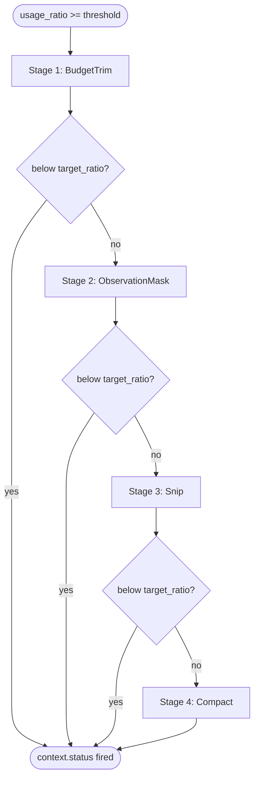

# Compaction

When the context window fills past a threshold, a four-stage cascade compresses old history. Each stage runs in order; the cascade stops as soon as usage drops below `target_ratio`.

## Cascade



| Stage | Action | Effect |
|---|---|---|
| 1. BudgetTrim | Truncate every tool result over `budget_max_chars`, append `[... truncated, original: N bytes ...]`. | Bounded loss; no message removed. |
| 2. ObservationMask | Replace tool results outside the last `keep_last` with `[observation masked]`. Assistant tool-call records are kept so the reasoning trace stays valid. | Aggressive token savings; recent context unchanged. |
| 3. Snip | Drop messages older than the protected window and replace them with `[N earlier messages snipped]`. Adjusts the boundary so a tool result is never separated from its tool call. | Heavy compression; only the protected tail and a marker remain. |
| 4. Compact | Run the configured `Summarizer` over the dropped messages and replace them with `[Summary of N earlier messages]\n{summary}`. Skipped when no summarizer is configured. | Lossy but readable summary. |

## Configuration

Set via [`agent.configure`](../methods/agent.configure.md) `compaction`:

```json
{
  "compaction": {
    "enabled": true,
    "budget_max_chars": 2000,
    "keep_last": 6,
    "target_ratio": 0.6,
    "summarizer": "llm"
  }
}
```

| field | type | default | description |
|---|---|---|---|
| `enabled` | boolean | off | Toggle the cascade. |
| `budget_max_chars` | integer | 2000 | Per-tool-result cap (Stage 1). |
| `keep_last` | integer | 6 | Recent messages excluded from Stages 2–4. |
| `target_ratio` | number | 0.6 | Stop when `usage_ratio` drops below this fraction. |
| `summarizer` | string | "" | Built-in summarizer name. Empty = skip Stage 4. |

The threshold that triggers the cascade is set on the context manager itself; usage above the threshold runs the cascade. After the cascade completes a `context.status` notification fires (if streaming is enabled).

## Built-in summarizers

| Name | Behaviour |
|---|---|
| `llm` | Calls the configured LLM with a fixed instruction asking for a < 500-char summary preserving decisions, identifiers, file paths, and unresolved tasks. |

See [builtins.md](../builtins.md). Wrapper-side custom summarizers are not currently exposed over JSON-RPC.

## Tool-call / tool-result pair preservation

Stages 2–4 never split an assistant `tool_call` from its matching `tool` result. The boundary is shifted earlier when needed (see `adjustKeepBoundary` in the source).

## Implementation

- [`internal/context/compaction.go`](../../../internal/context/compaction.go) — cascade logic
- [`internal/context/manager.go`](../../../internal/context/manager.go) — Manager + threshold tracking
- [`internal/engine/builtin/summarizer.go`](../../../internal/engine/builtin/summarizer.go) — `llm` summarizer

## Related ADR

- [ADR-005: Context compaction cascade](../../../.claude/skills/decisions/005-context-compaction-cascade.md)
- [ADR-004: Context entry wrapper pattern](../../../.claude/skills/decisions/004-context-entry-wrapper-pattern.md)

## Example

### JSON

```json
{
  "jsonrpc": "2.0",
  "method": "agent.configure",
  "params": {
    "compaction": {
      "enabled": true, "budget_max_chars": 2000,
      "keep_last": 6, "target_ratio": 0.6, "summarizer": "llm"
    }
  },
  "id": 1
}
```

### Python

```python
from ai_agent import Agent, AgentConfig, CompactionConfig

async with Agent() as agent:
    await agent.configure(AgentConfig(
        compaction=CompactionConfig(
            enabled=True,
            budget_max_chars=2000,
            keep_last=6,
            target_ratio=0.6,
            summarizer="llm",
        ),
    ))
```
