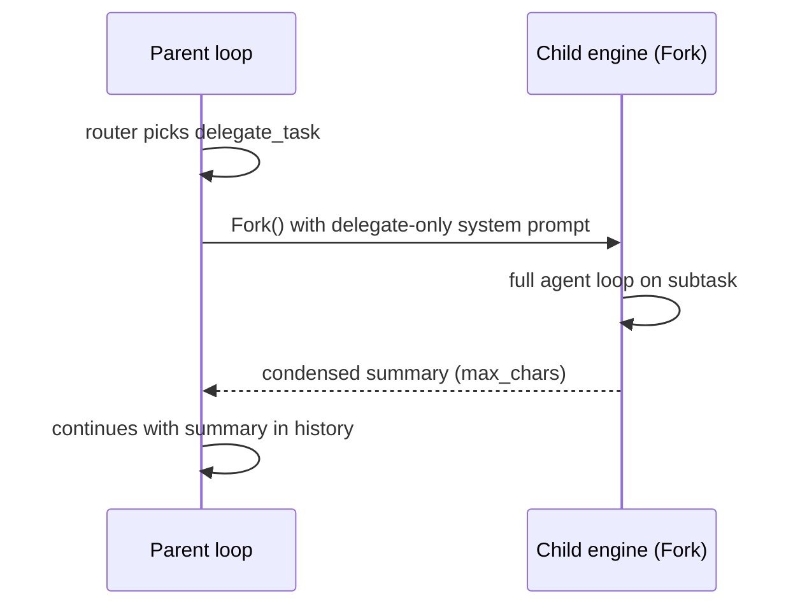
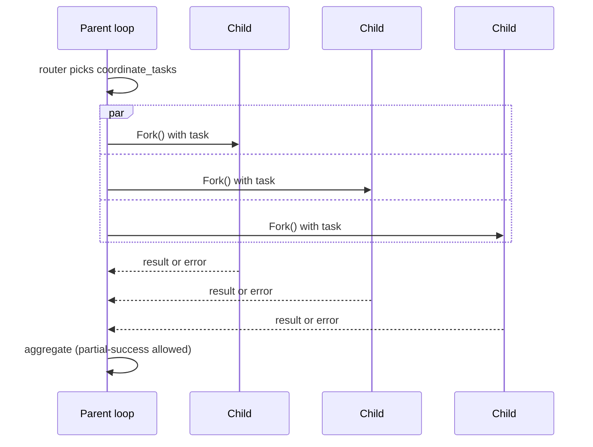

# Delegation

The harness ships three patterns for moving work out of the main loop:

- **`delegate_task`** — virtual tool. The router can call it like any other tool to spin up a child engine with a fresh context (ADR-006).
- **`coordinate_tasks`** — virtual tool. Runs multiple subtasks in parallel and aggregates results (ADR-009).
- **Worktree mode** — `delegate_task` variant that runs the child against an isolated git worktree (ADR-008).
- **Ralph Wiggum loop / `SessionRunner`** — file-system-backed multi-session loop for tasks that exceed an 8 K context (ADR-010).

All four patterns reuse the same `Engine.Fork` machinery, which inherits permission and guard policies but resets the user approver to `nil` (subagents are strictly fail-closed).

## delegate_task



Enable via [`agent.configure`](../methods/agent.configure.md) `delegate`:

```json
{ "delegate": { "enabled": true, "max_chars": 4000 } }
```

| field | type | description |
|---|---|---|
| `enabled` | boolean | Expose `delegate_task` to the router. |
| `max_chars` | integer | Cap on the child's result before it is added to the parent's history (ADR-007). |

The router's args for `delegate_task`:

| field | description |
|---|---|
| `task` | What the child should do (required). |
| `context` | Optional preamble. |
| `mode` | `"fork"` (default) or `"worktree"`. |

## coordinate_tasks



Enable via `coordinator`:

```json
{ "coordinator": { "enabled": true, "max_chars": 4000 } }
```

| field | type | description |
|---|---|---|
| `enabled` | boolean | Expose `coordinate_tasks` to the router. |
| `max_chars` | integer | Per-child result cap before aggregation. |

The router's args for `coordinate_tasks`:

| field | description |
|---|---|
| `tasks[]` | Each entry has `id` and `task`. |

The aggregator follows the partial-success pattern from ADR-009: a single failed child does not abort the others; the parent receives `[id]: {result or error}` lines for every child.

## Worktree mode

When `delegate_task` is called with `mode: "worktree"`, the child runs against a freshly created git worktree. The path is injected via `tool.ContextWithWorkDir` so file-touching tools can scope themselves. See ADR-008.

Configuration is shared with `delegate`. The worktree path is set via [`agent.configure`](../methods/agent.configure.md) `work_dir`.

## Ralph Wiggum loop (`SessionRunner`)

For tasks larger than the model's context, the `SessionRunner` runs a sequence of `Engine` instances and persists progress to a JSON file on disk. Each session reads the progress file at start and updates it before exit. Not exposed over JSON-RPC; used directly from Go callers.

## Implementation

- [`internal/engine/delegate.go`](../../../internal/engine/delegate.go) — virtual tool handling
- [`internal/engine/coordinator.go`](../../../internal/engine/coordinator.go) — parallel orchestration
- [`internal/engine/worktree.go`](../../../internal/engine/worktree.go) — git worktree integration
- [`internal/engine/session.go`](../../../internal/engine/session.go) — Ralph Wiggum loop
- [`pkg/tool/`](../../../pkg/tool/) — `ContextWithWorkDir`

## Related ADRs

- [ADR-006: Subagent virtual tool pattern](../../../.claude/skills/decisions/006-subagent-virtual-tool-pattern.md)
- [ADR-007: Subagent result truncation](../../../.claude/skills/decisions/007-subagent-result-truncation.md)
- [ADR-008: Worktree workdir via context](../../../.claude/skills/decisions/008-worktree-workdir-via-context.md)
- [ADR-009: Coordinator parallel execution](../../../.claude/skills/decisions/009-coordinator-parallel-execution.md)
- [ADR-010: Ralph Wiggum SessionRunner](../../../.claude/skills/decisions/010-ralph-wiggum-session-runner.md)

## Example

### JSON

```json
{
  "jsonrpc": "2.0",
  "method": "agent.configure",
  "params": {
    "delegate":    { "enabled": true, "max_chars": 4000 },
    "coordinator": { "enabled": true, "max_chars": 4000 },
    "work_dir":    "/tmp/agent-worktree"
  },
  "id": 1
}
```

### Python

```python
from ai_agent import Agent, AgentConfig, DelegateConfig, CoordinatorConfig

async with Agent() as agent:
    await agent.configure(AgentConfig(
        delegate=DelegateConfig(enabled=True, max_chars=4000),
        coordinator=CoordinatorConfig(enabled=True, max_chars=4000),
        work_dir="/tmp/agent-worktree",
    ))
```
