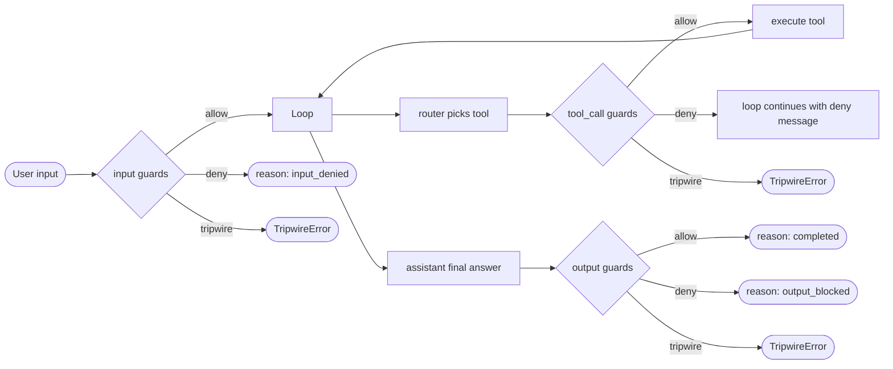

# Guards

Guards run at three points in the loop and are independent of the [permission pipeline](./permission.md). Permission decides *whether a tool may be called*; guards decide *whether the data is safe to process*.

## Three stages



| Stage | Fires before | Soft fail (`deny`) | Hard fail (`tripwire`) |
|---|---|---|---|
| `input` | `agent.run` accepts the prompt | Returns `reason: "input_denied"` | Run errors with `TripwireError` |
| `tool_call` | The tool is executed (after permission check) | Tool result replaced with deny message; loop continues; `reason: "guard_blocked"` for the turn | Run errors with `TripwireError` |
| `output` | The assistant's final text is delivered | Returns `reason: "output_blocked"` and a safe replacement message | Run errors with `TripwireError` |

`tripwire` is for emergency stops only — secret leaks the model is about to send, prompt-injection-driven attempts to escape the sandbox, etc. Use `deny` for routine policy enforcement.

## Configuration

Set via [`agent.configure`](../methods/agent.configure.md) `guards`. Each entry is the *name* of either a built-in or a wrapper-registered guard:

```json
{
  "guards": {
    "input":     ["prompt_injection", "max_length"],
    "tool_call": ["dangerous_shell"],
    "output":    ["secret_leak"]
  }
}
```

| field | type | description |
|---|---|---|
| `input` | string[] | Names checked against the user prompt. |
| `tool_call` | string[] | Names checked against the proposed tool call. |
| `output` | string[] | Names checked against the final assistant text. |

## Built-in names

| Stage | Name | Behaviour |
|---|---|---|
| `input` | `prompt_injection` | Detects classic injection patterns (`ignore previous instructions`, `you are now a ...`, etc.). |
| `input` | `max_length` | Rejects inputs longer than 50 000 chars. |
| `tool_call` | `dangerous_shell` | Detects `rm -rf /`, fork bombs, `mkfs`, `dd`, raw disk writes, `shutdown`, `reboot`. |
| `output` | `secret_leak` | Detects OpenAI / Anthropic / AWS / GitHub / Slack tokens and PEM private keys. |

See [builtins.md](../builtins.md) for the regex sources.

## Wrapper-registered guards

Use [`guard.register`](../methods/guard.register.md) to add custom guards. The core invokes them via [`guard.execute`](../methods/guard.execute.md). Names registered there are valid in the `guards.*` lists.

## Implementation

- [`internal/engine/guard.go`](../../../internal/engine/guard.go) — interfaces and decisions
- [`internal/engine/guard_registry.go`](../../../internal/engine/guard_registry.go) — pipeline runner
- [`internal/engine/builtin/guards.go`](../../../internal/engine/builtin/guards.go) — built-in implementations
- [`internal/engine/builtin/registry.go`](../../../internal/engine/builtin/registry.go) — name → instance lookup
- [`internal/engine/tripwire.go`](../../../internal/engine/tripwire.go) — `TripwireError`

## Related ADR

- [ADR-012: Permission + Guards two-layer pattern](../../../.claude/skills/decisions/012-permission-guard-two-layer-pattern.md)
- [ADR-015: Remote guard / verifier pattern](../../../.claude/skills/decisions/015-remote-guard-verifier-pattern.md)

## Example

### JSON

```json
{
  "jsonrpc": "2.0",
  "method": "agent.configure",
  "params": {
    "guards": {
      "input":     ["prompt_injection"],
      "tool_call": ["dangerous_shell"],
      "output":    ["secret_leak"]
    }
  },
  "id": 1
}
```

### Python

```python
from ai_agent import Agent, AgentConfig, GuardsConfig

async with Agent() as agent:
    await agent.configure(AgentConfig(
        guards=GuardsConfig(
            input=["prompt_injection"],
            tool_call=["dangerous_shell"],
            output=["secret_leak"],
        ),
    ))
```
