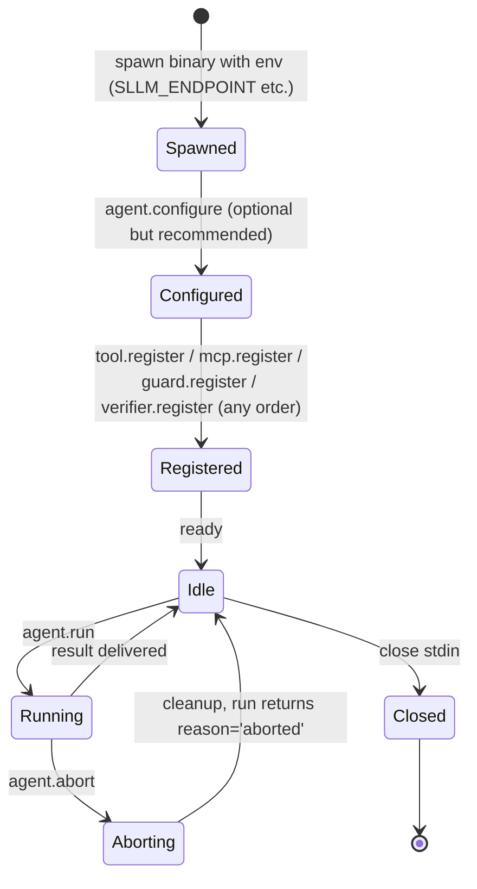

# Lifecycle

The `ai-agent` binary is a long-running subprocess. Wrappers manage its lifecycle through stdin / stdout. The flow is:

## 1. Spawn

The wrapper spawns the binary as a subprocess. Required env vars:

| Env | Purpose |
|---|---|
| `SLLM_ENDPOINT` | OpenAI-compatible chat completions URL. |
| `SLLM_API_KEY` | API key forwarded to the LLM. |

The binary writes JSON-RPC messages to stdout, expects them on stdin, and writes logs to stderr. See [overview.md](../overview.md#communication-model) for the strict stdin/stdout/stderr separation.

## 2. Configure

Call [`agent.configure`](../methods/agent.configure.md) once before the first `agent.run`. The result `applied[]` lists fields that took effect. Every field is optional; omitted fields keep their default.

Concurrent `agent.configure` and `agent.run` are not allowed — both check the same busy flag and return [`-32002 AgentBusy`](../errors.md) on collision.

## 3. Register

Tools, guards, and verifiers can be registered in any order, before or between `agent.run` calls. Registrations are additive and persist for the lifetime of the subprocess.

| Method | Registers |
|---|---|
| [`tool.register`](../methods/tool.register.md) | Wrapper-implemented tools |
| [`mcp.register`](../methods/mcp.register.md) | External MCP server's tools |
| [`guard.register`](../methods/guard.register.md) | Wrapper-implemented guards (referenced from `agent.configure` `guards.*`) |
| [`verifier.register`](../methods/verifier.register.md) | Wrapper-implemented verifiers (referenced from `agent.configure` `verify.verifiers`) |

## 4. Run

[`agent.run`](../methods/agent.run.md) starts the loop. History accumulates across calls — call `agent.run` repeatedly for multi-turn dialogue. Only one run at a time.

During a run the core may emit:

- Notifications: `stream.delta`, `context.status`.
- Callbacks: `tool.execute`, `guard.execute`, `verifier.execute`.

The wrapper must process these promptly. Blocking the stdin reader stalls the entire RPC channel.

## 5. Abort

[`agent.abort`](../methods/agent.abort.md) cancels the current run. The in-flight `agent.run` returns with `reason: "aborted"` (or errors with `-32003 Aborted` if the abort raced ahead of the result).

## 6. Close

The wrapper terminates the binary by closing stdin. The core completes any in-flight handler, drains the pending request map, and exits.

SDK helpers:

- Python — `async with Agent() as agent:` (closes on exit).
- TypeScript — `await using agent = await Agent.open()` (closes on scope exit).

## Common pitfalls

- **Calling `agent.run` before `agent.configure`** — works, but the harness uses defaults (no guards, no streaming).
- **Registering a guard but not listing it** — registration only declares the name. The guard does nothing until [`agent.configure`](../methods/agent.configure.md) puts it into `guards.input` / `guards.tool_call` / `guards.output`. Same for verifiers.
- **Logging on stdout** — the wrapper's parser will choke. Anything not a valid JSON-RPC line on stdout is a bug.
- **Concurrent `agent.run`** — returns `-32002 AgentBusy`. Serialize calls per agent instance.

## Implementation

- [`cmd/agent/`](../../../cmd/agent/) — binary entry point.
- [`internal/rpc/server.go`](../../../internal/rpc/server.go) — `Serve`, graceful shutdown, message size cap.
- [`internal/rpc/handlers.go`](../../../internal/rpc/handlers.go) — method dispatch.
