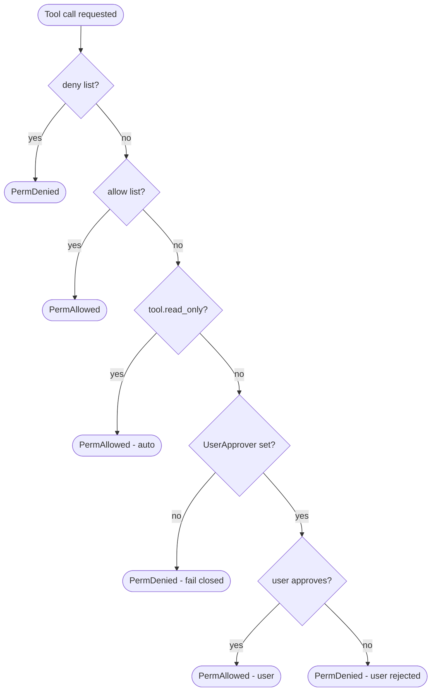

# Permission

The permission pipeline decides whether a tool call should run. It is a deterministic chain evaluated before the tool is executed and before any `tool_call` guard. The default policy is **fail-closed**: anything not explicitly allowed is denied.

## Pipeline



Order of evaluation:

1. **Deny list** — short-circuits to deny. `"*"` denies all tools.
2. **Allow list** — short-circuits to allow. `"*"` allows all tools.
3. **`read_only` auto-approve** — tools registered with `read_only: true` skip prompting.
4. **`UserApprover`** — when set, the core asks the user (REPL only).
5. **Fail-closed** — no approver and no allow rule means the call is denied.

Every decision is recorded by the `AuditLogger`. The default audit destination is the same writer as the harness logs (stderr).

## Configuration

Set via [`agent.configure`](../methods/agent.configure.md) `permission`:

```json
{
  "permission": {
    "enabled": true,
    "deny": ["dangerous_tool"],
    "allow": ["read_file", "list_dir"]
  }
}
```

| field | type | description |
|---|---|---|
| `enabled` | boolean | When `false`, no policy is installed and every tool runs (legacy behaviour). |
| `deny` | string[] | Names always denied. |
| `allow` | string[] | Names always allowed. |

`UserApprover` is not exposed over JSON-RPC; it is configured by the binary's runtime mode (REPL vs one-shot). One-shot mode has no approver, so anything not in `allow` and not `read_only` is denied.

## Subagent inheritance

Forked engines (used for `delegate_task`, `coordinate_tasks`, worktree) inherit the parent's policy but reset the approver to `nil`. Subagents are therefore strictly fail-closed.

## Built-ins

Permission has no built-in names — `deny` and `allow` accept the user's tool names directly.

## Implementation

- [`internal/engine/permission.go`](../../../internal/engine/permission.go)
- [`internal/engine/audit.go`](../../../internal/engine/audit.go)

## Related ADR

- [ADR-012: Permission + Guards two-layer pattern](../../../.claude/skills/decisions/012-permission-guard-two-layer-pattern.md)

## Example

### JSON

```json
{
  "jsonrpc": "2.0",
  "method": "agent.configure",
  "params": {
    "permission": { "enabled": true, "deny": ["bash"], "allow": ["read_file"] }
  },
  "id": 1
}
```

### Python

```python
from ai_agent import Agent, AgentConfig, PermissionConfig

async with Agent() as agent:
    await agent.configure(AgentConfig(
        permission=PermissionConfig(enabled=True, deny=["bash"], allow=["read_file"]),
    ))
```
