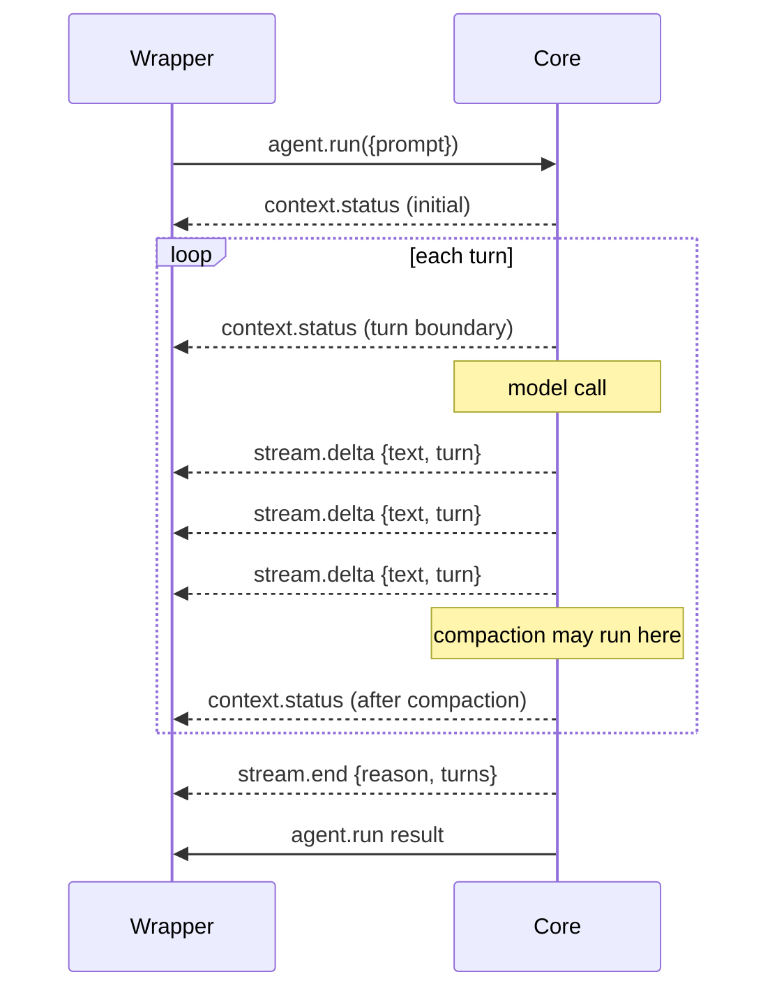

# Streaming

Streaming exposes two notifications from the core: `stream.delta` (incremental model output) and `context.status` (context window usage). Both are off by default and toggled independently from [`agent.configure`](../methods/agent.configure.md) `streaming`.

## Firing rules



| Notification | Fires when | Requires |
|---|---|---|
| `stream.delta` | The LLM client emits a token / chunk | `streaming.enabled = true` and the LLM client implements `StreamingCompleter` |
| `stream.end` | The loop terminates | `streaming.enabled = true` |
| `context.status` | At the start of `agent.run`, before each turn, after compaction | `streaming.context_status = true` |

When `streaming.enabled` is `false` the core falls back to non-streaming `ChatCompletion`. When the LLM client does not support streaming, the core also falls back silently — `stream.delta` simply never fires.

## Configuration

Set via [`agent.configure`](../methods/agent.configure.md):

```json
{ "streaming": { "enabled": true, "context_status": true } }
```

| field | type | description |
|---|---|---|
| `enabled` | boolean | Emit `stream.delta` and `stream.end`. |
| `context_status` | boolean | Emit `context.status`. |

## Wrapper handling

The wrapper must accept notifications even when it ignores them. SDKs hide this complexity behind callbacks (`on_delta`, `on_status`) or async iterators (`runStream`).

See [notifications.md](../methods/notifications.md) for the per-notification schema.

## Built-in names

Streaming has no built-in names — `enabled` and `context_status` are simple toggles.

## Implementation

- [`internal/engine/engine.go`](../../../internal/engine/engine.go) — `complete()` (streaming dispatch), `emitContextStatus()`, `stepCallback`
- [`internal/rpc/notifier.go`](../../../internal/rpc/notifier.go) — emits the JSON-RPC notifications
- [`internal/llm/`](../../../internal/llm/) — `StreamingCompleter` interface

## Related ADR

- [ADR-014: Streaming notification config](../../../.claude/skills/decisions/014-streaming-notification-config.md)

## Example

### JSON

```json
{
  "jsonrpc": "2.0",
  "method": "agent.configure",
  "params": { "streaming": { "enabled": true, "context_status": true } },
  "id": 1
}
```

### Python

```python
from ai_agent import Agent, AgentConfig, StreamingConfig

def on_delta(text: str, turn: int) -> None:
    print(text, end="", flush=True)

def on_status(ratio: float, count: int, limit: int) -> None:
    print(f"\n[{count}/{limit} = {ratio:.0%}]")

async with Agent() as agent:
    await agent.configure(AgentConfig(
        streaming=StreamingConfig(enabled=True, context_status=True),
    ))
    await agent.run("Stream me", stream=on_delta, on_status=on_status)
```
