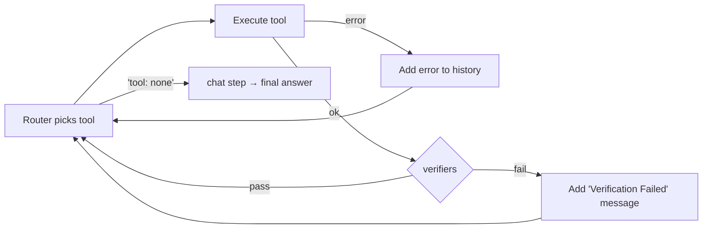

# Verify (PEV cycle)

The agent loop is a Plan-Execute-Verify (PEV) cycle. Verifiers run after every successful tool call. When a verifier fails, the loop injects a `[Verification Failed] ...` user message and gives the model another turn to correct itself.

## PEV cycle



Verification is **skipped** when:

- The tool execution itself errored (the model already sees the error).
- No verifiers are registered.

When verifiers run, all are invoked sequentially. A verifier that raises an error is logged and treated as if it had passed (skip-on-error policy in [`internal/engine/verify.go`](../../../internal/engine/verify.go)).

## Error classes

The engine classifies every step error into one of four classes (see [`internal/engine/errors.go`](../../../internal/engine/errors.go)):

| Class | Trigger | Recovery |
|---|---|---|
| `Transient` | Router parse error, empty LLM response | Exponential backoff, retry up to `max_step_retries`. |
| `LLMRecoverable` | Tool error or verify failure | Already added to the history. Loop continues; next turn the model sees the error and self-corrects. |
| `UserFixable` | HTTP 400 / 401 / 403 / 404 from LLM | Run returns `reason: "user_fixable"` with a human-readable message. |
| `Fatal` | Cancellation, tripwire, retry exhaustion | Run errors. |

The relationship between error classes and `agent.run` `reason`:

| Reason | Cause |
|---|---|
| `tool_use` | A tool ran successfully and the loop continues. |
| `tool_error` / `tool_not_found` | LLMRecoverable; counts toward `max_consecutive_failures`. |
| `verify_failed` | Verifier failed; counts toward `max_consecutive_failures`. |
| `permission_denied` | Permission pipeline rejected the call; counts toward consecutive failures. |
| `guard_blocked` | A `tool_call` guard returned `deny`; counts toward consecutive failures. |
| `max_consecutive_failures` | The above counter reached its limit. |
| `user_fixable` | UserFixable error; the wrapper should fix and retry. |

## Configuration

Set via [`agent.configure`](../methods/agent.configure.md) `verify`:

```json
{
  "verify": {
    "verifiers": ["json_valid", "non_empty"],
    "max_step_retries": 3,
    "max_consecutive_failures": 5
  }
}
```

| field | type | description |
|---|---|---|
| `verifiers` | string[] | Names of built-in or wrapper-registered verifiers. |
| `max_step_retries` | integer | Transient-error retries per turn (with exponential backoff capped at 8 s + 25 % jitter). |
| `max_consecutive_failures` | integer | Successive failed turns before stop. |

## Built-in names

| Name | Behaviour |
|---|---|
| `non_empty` | Fails when the result is empty or whitespace-only. |
| `json_valid` | Validates JSON syntax when the result starts with `{` or `[`. Other shapes pass through. |

See [builtins.md](../builtins.md).

## Wrapper-registered verifiers

Use [`verifier.register`](../methods/verifier.register.md). The core invokes them via [`verifier.execute`](../methods/verifier.execute.md).

## Implementation

- [`internal/engine/verify.go`](../../../internal/engine/verify.go) — Verifier interface and registry
- [`internal/engine/errors.go`](../../../internal/engine/errors.go) — error classification + backoff
- [`internal/engine/builtin/verifiers.go`](../../../internal/engine/builtin/verifiers.go) — built-ins

## Related ADR

- [ADR-015: Remote guard / verifier pattern](../../../.claude/skills/decisions/015-remote-guard-verifier-pattern.md)

## Example

### JSON

```json
{
  "jsonrpc": "2.0",
  "method": "agent.configure",
  "params": {
    "verify": { "verifiers": ["json_valid", "non_empty"], "max_consecutive_failures": 4 }
  },
  "id": 1
}
```

### Python

```python
from ai_agent import Agent, AgentConfig, VerifyConfig

async with Agent() as agent:
    await agent.configure(AgentConfig(
        verify=VerifyConfig(
            verifiers=["json_valid", "non_empty"],
            max_consecutive_failures=4,
        ),
    ))
```
