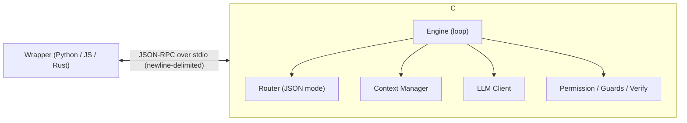
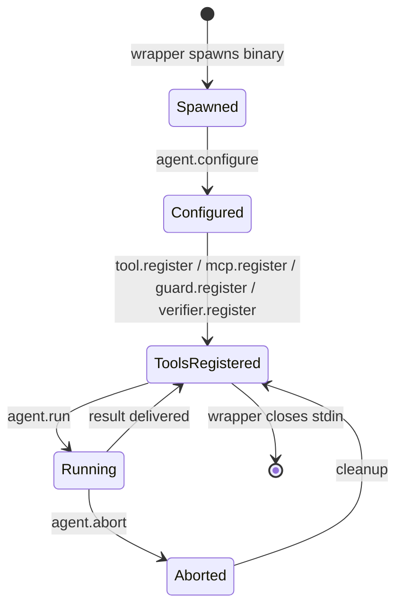

# Overview

`ai-agent` is a Go binary that runs an SLLM (small LLM) agent loop. Wrappers (Python, JavaScript, Rust, etc.) spawn the binary as a subprocess and exchange newline-delimited JSON-RPC 2.0 messages over stdio.

## Architecture



ASCII variant for environments without mermaid:

```
Wrapper (Python/JS) <-- JSON-RPC over stdio --> ai-agent core (Go)
                                                  |
                                                  +-- Engine (loop)
                                                  +-- Router (JSON mode)
                                                  +-- Context Manager
                                                  +-- LLM Client
                                                  +-- Permission / Guards / Verify
```

The core never makes outbound network calls except to the LLM endpoint configured via `SLLM_ENDPOINT`. If `agent.configure({ llm: { mode: "remote" } })` is in effect, even those LLM calls are forwarded to the wrapper via [`llm.execute`](./methods/llm.execute.md) — the core then has zero outbound HTTP traffic and the wrapper owns the LLM integration end-to-end (ADR-016).

## Communication model

- **Transport** — newline-delimited JSON-RPC 2.0 over stdin / stdout (ADR-001).
- **Logs** — never emitted on stdout; the core writes them to stderr only. Mixing logs into stdout breaks the wrapper's JSON parser.
- **Concurrency** — stdin is read by a single goroutine; handlers run concurrently. stdout writes are serialized by a mutex inside the core.
- **Message size** — capped at 10 MiB per line. Oversized messages get [`-32004 MessageTooLarge`](./errors.md).

## Message direction

| Direction | Methods |
|---|---|
| Wrapper → Core (request/response) | `agent.run`, `agent.abort`, `agent.configure`, `tool.register`, `mcp.register`, `guard.register`, `verifier.register` |
| Core → Wrapper (request/response) | `tool.execute`, `guard.execute`, `verifier.execute`, `llm.execute` |
| Core → Wrapper (notification, `id` omitted) | `stream.delta`, `stream.end`, `context.status` |

A notification has no `id` field and never receives a response. See [notifications.md](./methods/notifications.md).

## Lifecycle



Required ordering:

1. Wrapper spawns the `agent` binary with `SLLM_ENDPOINT` and `SLLM_API_KEY` env vars set.
2. Wrapper calls `agent.configure` once (optional but recommended — toggles guards, streaming, etc.).
3. Wrapper registers tools / guards / verifiers.
4. Wrapper calls `agent.run` (multiple times for multi-turn dialogue; history accumulates inside the core).
5. Wrapper closes stdin to terminate the binary.

See [lifecycle.md](./concepts/lifecycle.md) for the full state diagram and shutdown semantics.

## Versioning

- The API version lives in [`../openrpc.json`](../openrpc.json) `info.version` (currently `0.1.0`).
- **Additive changes** (new optional fields, new methods) ship in place and bump the minor version.
- **Breaking changes** are introduced under a new method name with a version suffix (`agent.run.v2`). The old method is kept until all wrappers have migrated.

This policy is enforced by [`pkg/protocol/spec_test.go`](../../pkg/protocol/spec_test.go) which checks that the OpenRPC document and Go types stay in sync.

## Reference

- Source of truth: [`pkg/protocol/methods.go`](../../pkg/protocol/methods.go), [`pkg/protocol/errors.go`](../../pkg/protocol/errors.go)
- Server implementation: [`internal/rpc/server.go`](../../internal/rpc/server.go)
- ADR-001 — JSON-RPC over stdio: [`../../.claude/skills/decisions/001-json-rpc-over-stdio.md`](../../.claude/skills/decisions/001-json-rpc-over-stdio.md)
- ADR-013 — RemoteTool + PendingRequests: [`../../.claude/skills/decisions/013-rpc-remote-tool-pending-requests.md`](../../.claude/skills/decisions/013-rpc-remote-tool-pending-requests.md)
